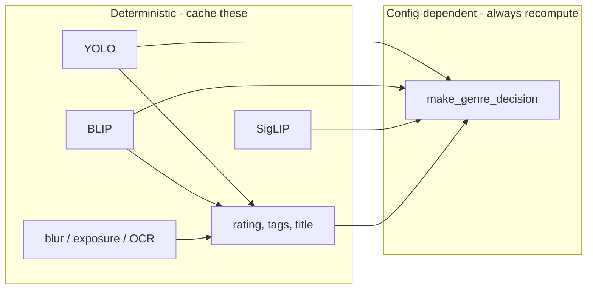

# Cache for Repetitive Image Results (Categorization Re-runs)

## Goal

When you re-run PhotoCat on the same directory after changing only **categorization config** (e.g. genre thresholds, boost/demote rules, taxonomy in [src/genre_decision.py](src/genre_decision.py)), the pipeline today re-runs YOLO, BLIP, SigLIP, blur, exposure, and OCR for every image again. Those outputs are **deterministic** for a given image and model set. Cache them so that:

- **Cache hit**: Load cached results, re-run only `make_genre_decision()` with current config, then write XMP/CSV/organize as usual. No image load, no GPU.
- **Cache miss**: Full pipeline as today; then write to cache for next time.

## What is repetitive vs config-dependent




| Output                           | Depends only on image + models                          | Depends on genre config | Action                 |
| -------------------------------- | ------------------------------------------------------- | ----------------------- | ---------------------- |
| YOLO detections                  | Yes                                                     | No                      | Cache                  |
| BLIP caption                     | Yes                                                     | No                      | Cache                  |
| SigLIP raw result (top_k scores) | Yes                                                     | No                      | Cache                  |
| Blur, exposure, OCR              | Yes                                                     | No                      | Cache                  |
| Rating, tags, title              | Yes (derived from above + image pixels for colors/mood) | No                      | Cache                  |
| Genre, review_status, top2       | No (uses cached inputs)                                 | Yes                     | Recompute on every run |


So we cache everything that is **not** genre decision. That way changing `genre_decision.py` or future `--min-confidence` only requires re-running the cheap, in-process `make_genre_decision()`.

## Cache contents (per image)

Store enough to serve a full result **without loading the image or running any model** on cache hit:

- **Identity / validation**: `path` (or key), `mtime`, `size` (for invalidation), `cache_version`
- **Model outputs**: `objects_detected` (list[str]), `caption` (str), `siglip_result` (dict: at least `top_k` as list of (label, score); same shape as [SceneClassifier.classify_scene](src/scene_classifier.py) return)
- **Analysis**: `ocr_result` (str), `is_blurry` (bool), `exposure` (str)
- **Derived**: `rating` (int), `tags` (list[str]), `title` (str)

For **genre_only** runs, we only have SigLIP + genre decision. Cache: `siglip_result` (+ path/mtime/size/version). On hit we skip SigLIP and only run `make_genre_decision(siglip_result)`.

## Cache key and invalidation

- **Key**: Image path (absolute or normalized relative to input_dir).
- **Valid entry** if:
  - File still exists and its current `mtime` and `size` match the stored `mtime` and `size`.
  - Stored `cache_version` equals the current process cache version.
- **Cache version**: A string that changes when cache format or model set changes so old entries are ignored. Options:
  - Single integer/schema version (e.g. `CACHE_SCHEMA_VERSION = 1`) bumped when we add/remove cache fields.
  - Optional: include model identifiers (e.g. YOLO path, BLIP/SigLIP model ids or their download dates) so upgrading models invalidates cache. Can be phase 2.

Result: **Image changed** (edit, replace) or **code/model upgrade** (version bump) → cache miss → full reprocess. **Only genre config changed** → cache hit → only genre recomputed.

## Where to store the cache

- **Location**: One cache store per input directory, e.g. `{input_dir}/.photocat_cache/` (hidden) or `{input_dir}/photocat_cache/`.
- **Format**: **SQLite** (single file, e.g. `.photocat_cache/cache.db`) with one table, keyed by path. Columns: `path` (TEXT PRIMARY KEY), `mtime` (REAL), `size` (INTEGER), `cache_version` (TEXT), `payload` (TEXT: JSON of the rest). This keeps one DB per run directory, portable and easy to delete or move with the photos.
- **CLI**: Add `--no-cache` to force full reprocess; add optional `--cache-dir PATH` to override default (default: `{input_dir}/.photocat_cache`).

## Pipeline integration

1. **Before processing an image** (in `process_image` or the batch loop):
  - If `--no-cache` or cache disabled, run full pipeline and (on success) write cache entry.
  - Else: stat the file (mtime, size); look up path in cache. If hit (same mtime/size and same cache_version), load payload (objects_detected, caption, siglip_result, ocr_result, is_blurry, exposure, rating, tags, title). Skip load_image, preprocess, YOLO, BLIP, SigLIP, blur, exposure, OCR, and rating/tags/title computation. Run **only** `make_genre_decision(siglip_result, yolo_detections=..., caption=..., ocr_text=..., title=...)` with current code/config. Build and return `(rating, tags, title, genre_result)`; optionally call `_clear_model_cache()` only when we actually ran models (no-op on full cache hit for that image).
2. **After full pipeline for an image** (cache miss or first run):
  - Write one row to the cache DB: path, mtime, size, cache_version, JSON payload of the fields above. Commit or batch commits per image/chunk.
3. **genre_only mode**:
  - Cache key: path + mtime + size + version. Payload: `siglip_result` only (or plus a flag that it’s genre_only). On hit: load siglip_result, run `make_genre_decision(siglip_result)`, return `(None, None, None, genre_result)`.
  - On miss: run SigLIP, then make_genre_decision, then store siglip_result.

## Edge cases

- **Failed image load**: Do not cache; return skipped result as today.
- **Partial batch (batch plan)**: When batching, cache lookup can be done per image before forming the batch: cache hits skip that image for GPU; only misses go into the batch. After the batch, write cache for all newly computed images. (Or first phase: caching only in sequential path; batch path can be cache-aware in a follow-up.)
- **Write XMP / organize**: Unchanged; they consume the same result tuple `(path, rating, tags, title, genre_result)` whether it came from cache or full run.
- **CSV audit**: Same; it only needs the result tuple.

## File change summary


| File                                        | Changes                                                                                                                                                                                                                                                                                                             |
| ------------------------------------------- | ------------------------------------------------------------------------------------------------------------------------------------------------------------------------------------------------------------------------------------------------------------------------------------------------------------------- |
| [src/cli.py](src/cli.py)                    | Add `--no-cache` (flag), optional `--cache-dir` (path, default from input_dir).                                                                                                                                                                                                                                     |
| New: `src/cache.py` (or `cache_backend.py`) | Open/create SQLite DB under cache_dir; `get(path, mtime, size)` → payload or None; `set(path, mtime, size, payload)`; `cache_version` constant; payload = JSON dict of cached fields.                                                                                                                               |
| [src/main.py](src/main.py)                  | In `process_image` (and later in batch path if added): if cache enabled, stat file and call cache get; on hit, build result from payload + `make_genre_decision(...)`, return. On miss or after full run, build payload and call cache set. Ensure genre_only path also uses cache (store/load siglip_result only). |


## Cache payload schema (JSON)

Example for full pipeline:

```json
{
  "objects_detected": ["person", "car"],
  "caption": "There are two people on a street.",
  "siglip_result": {
    "genre_label": "Street Photography",
    "confidence": 0.85,
    "top_k": [["Street Photography", 0.85], ["Nature Photography", 0.05], ...],
    "supporting_evidence": { ... }
  },
  "ocr_result": "",
  "is_blurry": false,
  "exposure": "normal",
  "rating": 4,
  "tags": ["person", "car", "street", ...],
  "title": "There are two people on a street."
}
```

For genre_only, payload can be `{"siglip_result": { ... } }` only. Code that reads cache must handle both shapes (full vs genre_only) using a `"mode"` or presence of keys.

## Testing

- Run on 274 images once → full processing; second run with same config → all cache hits, only genre recomputed (no GPU, fast).
- Change a constant in `genre_decision.py` (e.g. `_BOOST`), re-run → same cache hits, different genre/review_status in output.
- Run with `--no-cache` → full processing again.
- Change one image file (touch or replace), re-run → that image cache miss, rest hits.
- Delete cache dir and re-run → all misses.

## Optional later improvements

- **Cache version from models**: Invalidate when YOLO/BLIP/SigLIP model files or versions change.
- **Batch path**: When batch GPU plan is implemented, resolve cache per image first; only uncached images go into the batch; after batch, write cache for those.
- `**--min-confidence`**: If later wired into `make_genre_decision`, no cache change needed; genre is always recomputed on hit.

