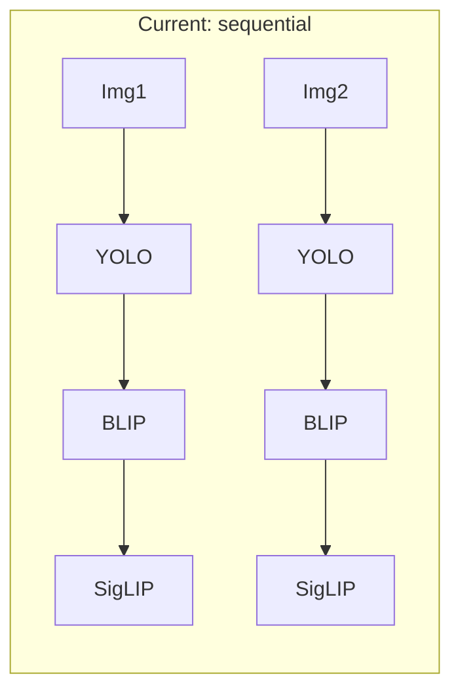
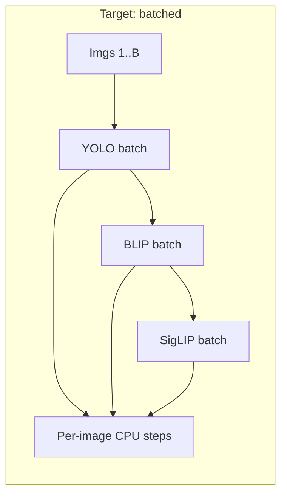

# Parallel GPU Processing Plan (Batch Inference)

## Current state

- **GPU is used** for YOLO, BLIP, and SigLIP (CUDA); default `workers=1` to avoid loading models multiple times.
- **Per-image flow**: For each image, the pipeline runs `detect_objects()` → `caption_image()` → `classify_scene()` sequentially. No batching.
- HuggingFace warns: *"You seem to be using the pipelines sequentially on GPU. In order to maximize efficiency please use a dataset."*

## Target architecture

- **Single process, single GPU**: Keep `workers=1`. Parallelism is **batch dimension** (many images per forward pass), not multiple processes.
- **Batch size**: Configurable (e.g. 8 default on GPU for ~8 GB VRAM); 1 or CPU disables batching and keeps current behavior.

## Implementation outline

### 1. CLI: add batch size

- **File**: [src/cli.py](src/cli.py)
- Add `--batch-size` (int, default `1`). Document that values > 1 enable batched GPU inference; recommend 4–16 for 8 GB VRAM.
- Optional: add `--no-batch` or keep batch_size=1 as the “sequential” mode. No change to `--workers` semantics.

### 2. Object detection: batch API

- **File**: [src/object_detection.py](src/object_detection.py)
- Ultralytics YOLO accepts a **list of images** (paths, PIL, or numpy) and returns a list of `Results`. Already supported.
- Add `detect_objects_batch(images: list, conf=0.5) -> list[list[str]]`:
  - Call `self.model(images, conf=conf, device=self.device)`.
  - For each result in the returned list, extract class names as in current `detect()` (handle empty boxes).
- Keep existing `detect(image, ...)` for single-image / sequential path.

### 3. Image captioning: batch API

- **File**: [src/image_captioning.py](src/image_captioning.py)
- Add `caption_images_batch(images: list) -> list[str]`:
  - Convert each OpenCV (BGR) image to PIL RGB; build list of PIL images.
  - Use `self.processor(images= pil_list, return_tensors="pt")` (processor accepts lists).
  - Move inputs to device/dtype as today; call `self.model.generate(**inputs, max_length=40, num_beams=2, early_stopping=True)`.
  - Decode each row of the generated tensor with `processor.decode(out[i], skip_special_tokens=True)`.
- **Risk**: BLIP batch inference has known issues in some setups (e.g. shape mismatches). Mitigation:
  - Implement batch path; on first OOM or runtime error in batch mode, **fallback to sequential** (loop over images, call existing `caption_image()`), and optionally log a one-time warning so the run still completes.

### 4. Scene classifier: batch API

- **File**: [src/scene_classifier.py](src/scene_classifier.py)
- HuggingFace zero-shot image classification pipeline accepts **multiple images** (e.g. `images=[img1, img2, ...]`); returns structure that can be per-image (check pipeline docs for exact return shape).
- Add `classify_scene_batch(images: list) -> list[dict]`:
  - Normalize each element to PIL (as in current `classify_scene`).
  - Call `self.pipe(images= pil_list, candidate_labels=self.labels, padding=True, truncation=True)`.
  - Map pipeline output to a list of the same dict shape as `classify_scene()` (genre_label, confidence, top_k, supporting_evidence) by aggregating per-image results and averaging prompt scores per genre.
- Keep `classify_scene(image)` for single-image path.

### 5. Main pipeline: batch orchestration

- **File**: [src/main.py](src/main.py)
- **When to use batch path**: `args.batch_size > 1` and device is CUDA (or MPS). Otherwise use current sequential loop (`process_and_write` per image).
- **Batch loop** (new function, e.g. `run_batch_pipeline()`):
  1. Chunk `image_files` into batches of `batch_size` (last chunk may be smaller).
  2. For each chunk:
    - **Load and preprocess**: For each path in the chunk, `load_image` + `preprocess_image`; collect successful (image, path) pairs; for failed loads, append a result tuple `(path, None, None, None, None)` and skip that path in GPU calls.
    - **GPU (batched)**:
      - If not `genre_only`: run `detect_objects_batch(images)`, then `caption_images_batch(images)` (with sequential fallback on error), then `classify_scene_batch(pil_images)`.
      - If `genre_only`: run only `classify_scene_batch(pil_images)`.
    - **Per-image CPU steps** (same logic as today): For each index in the chunk, run `is_blurry`, `check_exposure`, `ocr_text`, `analyze_scene`, `compute_composition_rating`, `compute_rating`, `generate_tags_from_all`, `refine_title`, `make_genre_decision` using the corresponding YOLO/BLIP/SigLIP outputs.
    - **Output**: Build result tuple per image `(img_path, rating, tags, title, genre_result)`; if `write_xmp`, call `write_xmp_sidecar` for each.
    - **Progress**: Print batch progress (e.g. `[Batch 3/35] Images 17-24`) and optionally keep or shorten per-image “Done” lines to avoid log spam.
  3. Concatenate all chunk results in order so the final `results` list matches `image_files` order 1:1 (required for CSV and `_organize_into_dirs`).
- **Cache clearing**: Call `_clear_model_cache()` after each chunk (or after each batched model call) to avoid VRAM creep.
- **Lazy singletons**: Batch path still uses `_get_captioner()` and `_get_scene_clf()` once; object_detection already has a module-level model. No multiprocessing in batch mode.

### 6. Backward compatibility and edge cases

- **batch_size=1 or CPU**: Do not use the new batch functions; keep the existing sequential `process_and_write` loop so behavior and log format stay unchanged.
- **genre_only**: Batch path runs only SigLIP batch + per-image `make_genre_decision`; no YOLO or BLIP.
- **Failed loads in chunk**: One failed image should not abort the chunk; produce a skipped result for that path and run GPU batch on the rest.
- **Last chunk**: Handle length < batch_size; batch APIs must accept variable-length lists (YOLO and HF pipelines do).

### 7. Optional improvements

- **OOM handling**: If a batch raises CUDA OOM, retry the chunk with batch_size halved (or sequential) and log; then continue.
- **Progress**: TQDM or a simple “Batch k/N” line to show throughput without printing every filename when batch_size > 1.

## File change summary

| File                                               | Changes                                                                                                                                                                          |
| -------------------------------------------------- | -------------------------------------------------------------------------------------------------------------------------------------------------------------------------------- |
| [src/cli.py](src/cli.py)                           | Add `--batch-size` (default 1).                                                                                                                                                  |
| [src/object_detection.py](src/object_detection.py) | Add `detect_objects_batch()`; keep `detect()` / `detect_objects()`.                                                                                                              |
| [src/image_captioning.py](src/image_captioning.py) | Add `caption_images_batch()` with sequential fallback on error; keep `caption_image()`.                                                                                          |
| [src/scene_classifier.py](src/scene_classifier.py) | Add `classify_scene_batch()`; keep `classify_scene()`.                                                                                                                           |
| [src/main.py](src/main.py)                         | Add batch path: chunking, batch load/preprocess, call batch APIs, per-image CPU steps and result assembly; branch on `batch_size > 1` and device; keep existing sequential path. |

## Testing

- Run with `--batch-size 1`: behavior and output should match current run (no batching).
- Run with `--batch-size 8` (or 4) on GPU: same CSV/organize results, lower total time per image.
- Run with `--genre-only --batch-size 8`: only SigLIP batched; same genre outcomes.
- Test with a directory containing a failing image (e.g. corrupt file): one skipped row, rest of batch and other batches complete.

## Out of scope

- **Multi-GPU**: Single GPU only; no `DataParallel` or multi-device batching.
- **Changing `--workers`**: Remains 1 for GPU; batch parallelism replaces process-level parallelism for GPU work.

